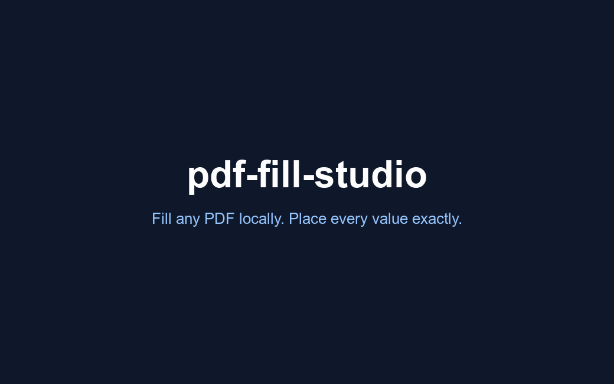

# pdf-fill-studio

> Fill any PDF on your machine, then drag every value into place.



pdf-fill-studio fills PDF forms locally and hands you a visual editor to fix the
placement. It detects how a PDF is built and fills it the right way. The filled
values show up over a browser preview of the real page. You drag them into the
boxes, nudge with the arrow keys, and export. Nothing leaves your machine. The
signature line stays empty so you sign it yourself.

### Why

Most forms you actually have to fill have no form fields. The text is right, it
just has to sit on the correct line, and getting there by typing coordinates is
slow. The hosted tools that do this upload your document to a server, which you
don't want for tax or insurance paperwork. This keeps everything local and gives
you a real editor instead.

### What it does today

- Fills flat PDFs (no form fields) by overlaying text where it belongs, snapped to the line.
- Per-character (comb) fields: one character centered per cell (postal codes, SINs, dates).
- Browser editor: drag values over the rendered page, 1px nudges with the arrow
  keys, signature left blank.
- AcroForm (native fields) fill, with profile autofill from a private JSON. A SIN or bank number is never stored.
- XFA forms (LiveCycle / many government forms): best-effort fill by injecting the XFA datasets, with a free Adobe Reader fallback for dynamic forms that defeat headless tools.
- Runs as a Claude Code skill. MIT licensed, and it never touches the network at runtime.

### Profile

Copy `profile.example.json` to `profile.json`, fill in your own data, and pass it with `--profile profile.json`. The CLI fills every matched field automatically and prints what still needs manual input. Keep `profile.json` out of git (it is already in `.gitignore` by convention; add it if needed). A SIN, bank account, or card number in the profile file is silently skipped and never written to any PDF.

## Install

**With pip** (gives the `pdf-fill-studio` command):

```bash
pip install pdf-fill-studio
pdf-fill-studio path/to/form.pdf
```

**As a Claude Code plugin:**

```
/plugin marketplace add KevinDoremy/pdf-fill-studio
/plugin install pdf-fill-studio@pdf-fill-studio
```

**From source:**

```bash
git clone https://github.com/KevinDoremy/pdf-fill-studio
cd pdf-fill-studio
python3 -m venv .venv && source .venv/bin/activate
pip install -e .
pdf-fill-studio path/to/form.pdf
```

## As an MCP server (optional)

Expose the fill tools over the Model Context Protocol:

```bash
pip install "pdf-fill-studio[mcp]"
pdf-fill-studio-mcp        # stdio MCP server: detect_pdf_type, list_fields, fill_acroform_fields, fill_flat_text
```
